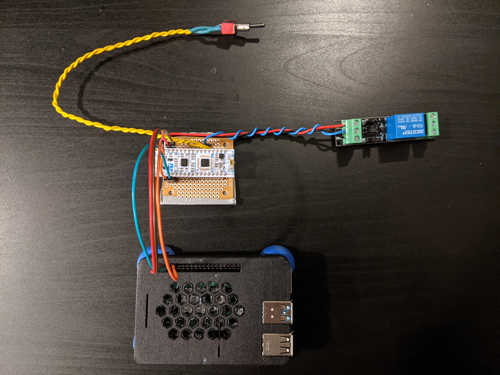

# PiPonics
PiPonics is a full-stack web server for hydro/aero/aquaponics monitoring and control, consisting of a Raspberry Pi 4B connected to an [STM32L432KC Nucleo Board](https://www.st.com/en/evaluation-tools/nucleo-l432kc.html) via UART. The \*ponics system is defined in a single configuration file `config.json`.

## System Overview
The goal of this system was to develop a framework for remote monitoring and control that can be configured via a single configuration file. Unfortunately the usage of an MCU board results in some repeated configuration steps between the Pi and STM32 (i.e. mapping sensor IDs). Therefore an overview of the tools and services used for this project are provided below in case they can be reused in other applications.
### Raspberry Pi
The web server is implemented as a series of Docker containers, orchestrated with docker-compose. They are described here:
- **db-init**: Parses `config.json` and generates a database initialization SQL script for storing sensor readings and metadata. Automatically gets loaded into **db**'s init directory at startup.
- **config-init**: Parses and adds some extra fields to `config.json`, such as UUIDs to all entities.
- **db**: A [PostgreSQL](https://www.postgresql.org/) server for storing sensor readings.
- **backend**: Bulk of processing done here. Hosts a [Flask](https://flask.palletsprojects.com/) API server for sensor data/actuator commands and communicates with the STM32 via [pyserial](https://pypi.org/project/pyserial/).
- **frontend**: Angular web application running on Node.js. Uses [Bootstrap's Grid System](https://getbootstrap.com/docs/5.0/layout/grid/) and the popular [Chart.js](https://www.chartjs.org/) library for displaying sensor readings. *NOTE: PiPonics was deisgned for usage within a local network and currently uses a development server for hosting the frontend application. Serve publicly at your own risk.*
### NUCLEO-L432KC
The STM32L432KC Nucleo Board is used as an I/O board for interfacing with sensors and actuators. It is implemented as a FreeRTOS application with two tasks:
- **ReceiveUART**: Waits for UART command frame from Pi (typically request for sensor reading or actuator drive) and sends response.
- **DetectOverflow**: Detects if the grow bed has flooded via a float switch. If triggered, grow bed water pump is automatically shut off and a piezo buzzer starts beeping to alert user.

## Related
This project was the inspiration for [ponics32](https://github.com/karaulj/ponics32), an all-in-one \*ponics management server based on the ESP32 microcontroller.
